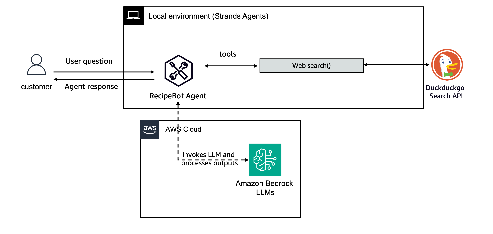

# Interactive Recipe Bot

This example demonstrates a simple interactive agent that helps with recipes and cooking information.

## Architecture
Here is what we are building:

## Running the Recipe Bot

1. Navigate to this directory: `cd /02-simple-interactive-usecase/`
2. Install dependencies: `pip install -r requirements.txt`
3. Run the bot: `python recipe_bot.py`

You can then interact with the Recipe Bot through the command line interface. Ask for recipes, cooking tips, or general food information.

Type `exit` to quit the application.