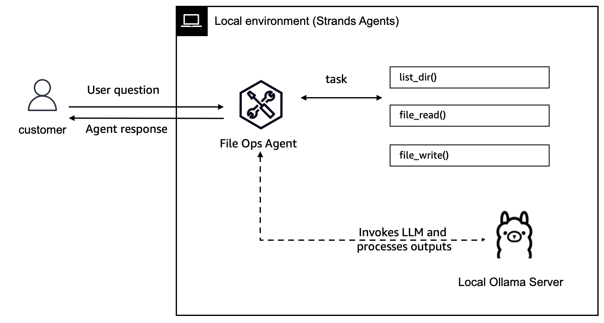

## Model Providers in Strands Agents

Strands Agents supports multiple model providers, allowing you to choose the best foundation model for your specific use case. This flexibility enables you to build agents that can leverage different capabilities, cost structures, and deployment options.
Supported Model Providers

Strands Agents supports several model providers out of the box:

1. [**AWS Bedrock**](https://strandsagents.com/0.1.x/user-guide/concepts/model-providers/amazon-bedrock/): Use Amazon's managed service to access high-performing foundation models from leading Providers like Anthropic, Meta, Amazon etc.
2. [**Anthropic**](https://strandsagents.com/0.1.x/user-guide/concepts/model-providers/anthropic/): Direct API access to Claude models
3. [**Ollama**](https://strandsagents.com/0.1.x/user-guide/concepts/model-providers/ollama/): Run models locally for privacy or offline use
4. [**LiteLLM**](https://strandsagents.com/0.1.x/user-guide/concepts/model-providers/litellm/): Unified interface for OpenAI, Mistral, and other providers
    - **Azure OpenAI**: Leverage OpenAI models hosted on Microsoft Azure
    - **OpenAI**: Access models like GPT-4/ gpt-4o
5. [**Custom Providers**](https://strandsagents.com/0.1.x/user-guide/concepts/model-providers/custom_model_provider/): Build your own provider for specialized needs

## Model tutorials
In this folder you'll find two samples:

1. [Ollama](./01-ollama-model/):
We showcase an example of a local file-ops agent that can perform simple operations (`file_read`, `file_write` and `list_directory`). You can extend it to add more tools to make it more capable.

Here's the architecture:

2. [OpenAI Access via LiteLLM](./02-openai-model/):
We show an example of a simple agent that can access OpenAI models via Azure. It has access to basic tools like `current_weather` and `current_time`.

Here's the architecture:

Note: For all models you can add [Callback Handlers](https://strandsagents.com/0.1.x/user-guide/concepts/streaming/callback-handlers/) that allow you to intercept and process events during agent execution.