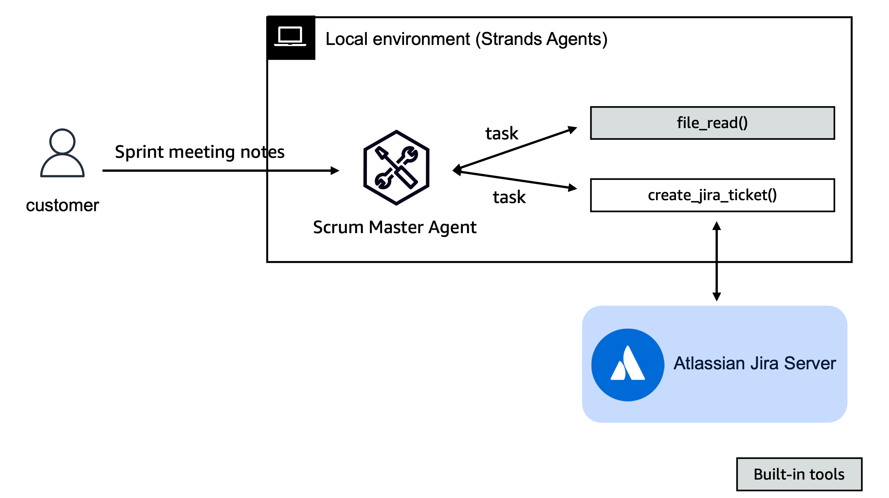

# Scrum Master Assistant

An expert agile development assistant for JIRA specializing in breaking down meeting notes into actionable tasks. Using this implementation, product teams can convert high-level plan items from biweekly planning meetings into well-structured, detailed Jira tickets.

|Feature             |Description                                        |
|--------------------|---------------------------------------------------|
|Agent Structure     |Single-agent architecture                          |
|Native Tools        |file_read                                          |
|Custom Agents       |create_jira_ticket                                 |
|Model Provider      |Amazon Bedrock                                     |

## Getting Started

1. Install [uv](https://docs.astral.sh/uv/getting-started/installation/).

2. Set up AWS credentials in `.env` using [.env.example](./.env.example).

3. Run the SCRUM Master Assistant using `uv run jira_assistant.py`
