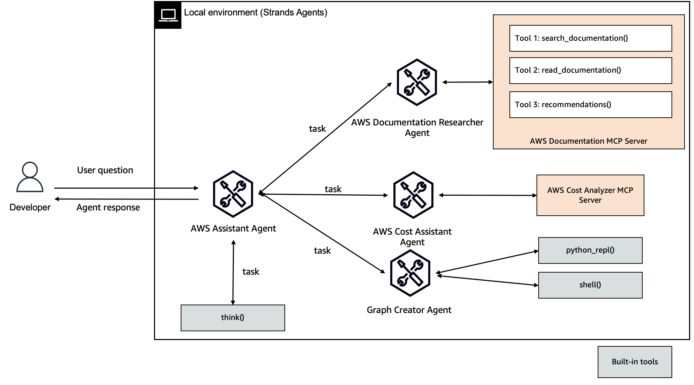

# 🚀 AWS Assistant

## Overview

AWS Assistant is a sophisticated multi-agent system designed to provide comprehensive insights and assistance for AWS-related queries. Leveraging advanced AI technologies and model context protocol (MCP), this assistant offers three primary specialized agents:

|Feature             |Description                                        |
|--------------------|---------------------------------------------------|
|Agent Structure     |Multi-agent architecture                           |
|Native Tools        |think, file_write, python_repl, shell              |
|Custom Agents       |aws_documentation_researcher, graph_creater, aws_cost_assistant|
|MCP Servers         |[AWS Cost Explorer](https://github.com/aarora79/aws-cost-explorer-mcp-server), [AWS Documentation](https://awslabs.github.io/mcp/servers/aws-documentation-mcp-server/)               |
|Model Provider      |Amazon Bedrock                                     |

> [!CAUTION]
> `python_repl` and `shell` tools can run commands in your environment. Make sure to run this sample in a sandbox environment.

## Key Features

### 1. AWS Documentation Researcher 📚

- Searches and analyzes AWS documentation
- Provides detailed, source-cited explanations
- Ideal for technical and procedural AWS queries

### 2. AWS Cost Assistant 💰

- Analyzes AWS account spending
- Generates detailed cost breakdowns
- Supports queries about service expenditures, regional costs, and usage patterns

### 3. Graph Creator 📊

- Visualizes complex AWS cost and usage data
- Generates interactive graphs using Plotly
- Transforms raw data into meaningful visual representations

## Getting Started

1. Install [uv](https://docs.astral.sh/uv/getting-started/installation/).

2. Install Docker and make sure the Docker daemon is running. Checkout [Docker Desktop](https://docs.docker.com/desktop/), and [explore Docker Desktop](https://docs.docker.com/desktop/use-desktop/).

3. Setup [aws-cost-explorer-mcp-server](https://github.com/aarora79/aws-cost-explorer-mcp-server) MCP server.

4. Set up AWS credentials in `.env` using [.env.example](./.env.example).

5. Complete [prerequisites](https://github.com/aarora79/aws-cost-explorer-mcp-server?tab=readme-ov-file#prerequisites) for aws-cost-explorer-mcp-server.

    > [!DISCLAIMER]
    > `python_repl` tool uses `plotly` to create graphs. Make sure to `pip install plotly` before using the `Graph Creater Agent`

6. Run the AWS Assistant using `uv run main.py`

## Example Queries

- "Explain AWS Lambda triggers"
- "What's my AWS spending this month?"
- "Create a graph of my service costs"
