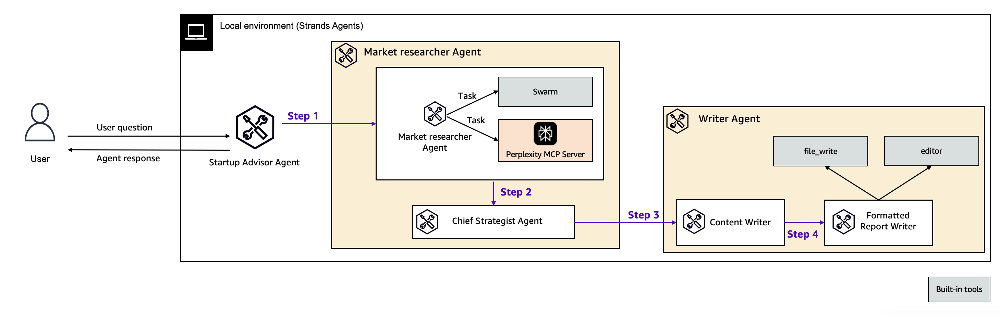

# Startup Advisor using Perplexity MCP server

Have a new startup in mind, but haven't quite hired your marketing staff? Use this Startup Advisor agent to do your market research, come up with campaign ideas, and write effective campaign copy.

|Feature             |Description                                        |
|--------------------|---------------------------------------------------|
|Agent Structure     | Multi-agent architecture                          |
|Native Tools        |swarm, file_write, editor                          |
|Custom Agents       |market_research_team, writer_team                  |
|MCP Servers         |[Perplexity search](https://github.com/jsonallen/perplexity-mcp)|
|Model Provider      |Amazon Bedrock                                     |

## Key Features

- Shows sequential mult-agent architecture using Strands Agent
- Agentic search using the Perplexity MCP server.
- Utilizes the `swarm` tool, allowing a swarm of agents to collaborate on market research. Checkout multi-agent systems and [Swarm](https://strandsagents.com/latest/user-guide/concepts/multi-agent/swarm/) intelligence with Strands for more information.

## Prerequisites

1. Install [uv](https://docs.astral.sh/uv/getting-started/installation/).
2. Follow guidance [here](https://docs.perplexity.ai/guides/getting-started) to get started with perplexity AI.
3. Create .env file with [.env.example](./.env.example).
4. Run `uv run main.py`
