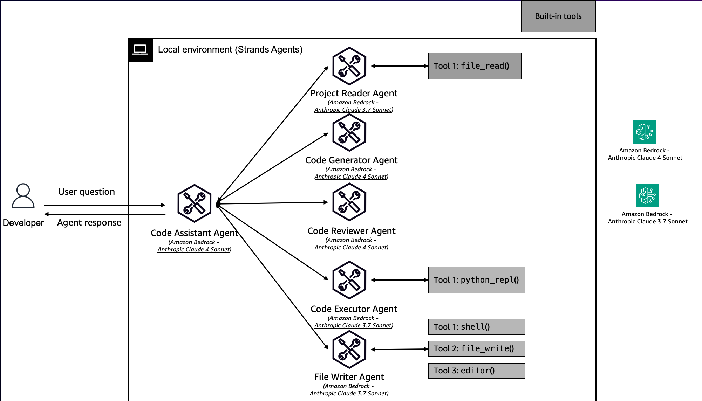

# 🚀 Code Assistant Agent: Introducing the Next-Generation Coding Sidekick

Imagine having a tireless, intelligent programming partner available 24/7, ready to transform your coding experience. The Code Assistant Agent is not just another tool—it's your personal AI-powered coding companion designed to supercharge your development workflow.



The agent leverages advanced AI models to understand context, generate solutions, and provide comprehensive coding support.

|Feature             |Description                                        |
|--------------------|---------------------------------------------------|
|Agent Structure     | Multi-agent architecture                          |
|Native Tools        | file_read, shell, file_write, editor python_repl  |
|Custom Agents       |Project Reader, Code Generator, Code Reviewer, Code Executor, File Writer|
|Model Provider      |Amazon Bedrock                                     |

## 💻 Getting Started

1. Install [uv](https://docs.astral.sh/uv/getting-started/installation/).

2. Run `uv run main.py`

## 🤖 How It Works

Simply type your coding task or question, and the Code Assistant Agent springs into action:

```bash
> Create a function to calculate Fibonacci sequence
> Explain a complex algorithm
> Convert JavaScript code to Python
> Debug my existing script
```
