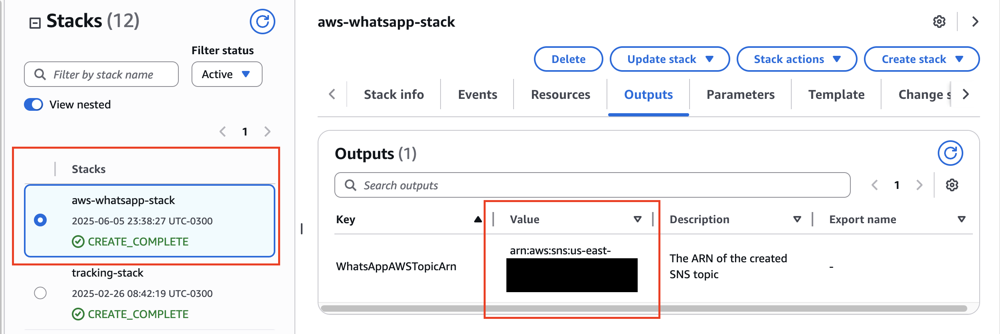
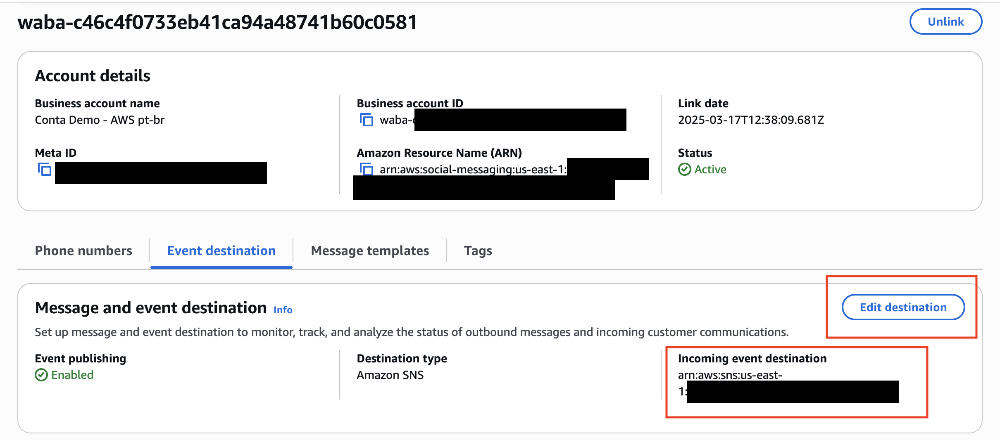

## WhatsApp for Business, Strands-Agents and Amazon Bedrock Demo

> [!IMPORTANT]
> This sample is meant to show integration of Strands agent with WhatsApp and is for inspirations purposes. Make sure to implement your organizations best practices before deploying this solution in production workloads.

This demo aims to demonstrate how to use Meta's WhatsApp for Business integrated with **Strands-Agents** and Amazon Bedrock.

It's a multi-agent demo, that will handle tasks for a fictitious fintech. One agent is responsible for loading daily promotions based on the day of the week, and another one is responsible for handling credit card operations, being able to load the last X days of fake transactions and schedule payments.

Below is the overall architecture diagram:


|Feature             |Description                                        |
|--------------------|---------------------------------------------------|
|Agent Structure     |Multi-agent architecture                          |
|Custom Agents       |get_transactions, put_payment, get_promotions, get_day_of_week|
|Model Provider      |Amazon Bedrock                                     |


1. The user interacts with the WhatsApp number.
2. AWS End User Messaging receives the message and adds it to an SNS Topic.
3. A Lambda function listening to this topic handles the message.
4. The multi-agent system processes this message and redirects it to the desired agent.


## 1 - Getting started with AWS End User Messaging Social (Mandatory)

1. Have a Meta Business Account. Check if your company already has a [Meta Business Account](https://business.facebook.com/). If you don't have a Meta Business Account, you can create one during the sign-up process.

1. To use a phone number that's already in use with the WhatsApp Messenger application or WhatsApp Business application, you must delete it first.

1. A phone number that can receive either an SMS or a voice One-Time Passcode (OTP). The phone number used for sign-up becomes associated with your WhatsApp account and the phone number is used when you send messages. The phone number can still be used for SMS, MMS, and voice messaging.

1. Them, follow up "Sign up through the console" step by step guide from [AWS End User Messaging Documentation](https://docs.aws.amazon.com/social-messaging/latest/userguide/getting-started-whatsapp.html).

## 2 - AWS Envirnoment Setup

### 2.1 Amazon Bedrock Model Access

Ensure you have access to Bedrock Models. If you are using a cross-region profile, make sure the model is enabled in both regions necessary for the profile to work.

[Here](https://docs.aws.amazon.com/bedrock/latest/userguide/model-access-modify.html) is more information on how to enable model access on Amazon Bedrock.

### 2.2 - Virtual Env Setup

Create a virtual environment and install dependencies.

```
python3 -m venv .env
source .env/bin/activate
pip install -r requirements.txt
```

### 2.3 Create Lambdas, upload to S3 and deploy Cloudformation

This project supports two languages:

1. Brazilian Portuguese (pt_BR)
1. US English (en_US)

**By default, `pack_and_deploy.sh` will deploy English locale, but you can change on `template.yaml` file. Change the parameter `LocaleConfig` for the desired locale at the beginning of the CloudFormation Template file, to change solution language!**

**Before getting started, it's necessary to have a S3 Bucket available to store assets that will be created by CloudFormation stack. If you don't have a S3 Bucket, please create one following [this](https://docs.aws.amazon.com/AmazonS3/latest/userguide/create-bucket-overview.html) documentation.**

This shell script will pack all Lambda functions and deploy Cloudformation stack.

```
chmod +x lambda_pack.sh

export S3_BUCKET=<S3_BUCKET>
export S3_KEY=<S3_KEY>

./pack_and_deploy.sh $S3_BUCKET $S3_KEY

```

Example:

```
./pack_and_deploy.sh my-s3-bucket my-folder-assets
```

**By default, this project is building using Python 3.11, but you can change with an optional parameter PYTHON_VERSION, by calling bash with following args:**

```
./pack_and_deploy.sh my-s3-bucket my-folder-assets "3.11"
```

### 2.4 Cloudformation post-step

After the stack is created with CloudFormation, retrieve the SNS topic from the Outputs.



This will be used as the entry point for AWS End User Messaging. **Copy** SNS output ARN value.

Go to AWS End User Messaging Console, choose *Social Messaging*, on left menu.
Choose your WhatsApp for Business account integration and click on "Event Destination" tab.
Click in "Edit Destination" to add your SNS output from Cloud Formation.



### 2.5 Demo

This is a demo showing working solution with English locale:


## 3. Delete Resources

```
./destroy.sh
```
