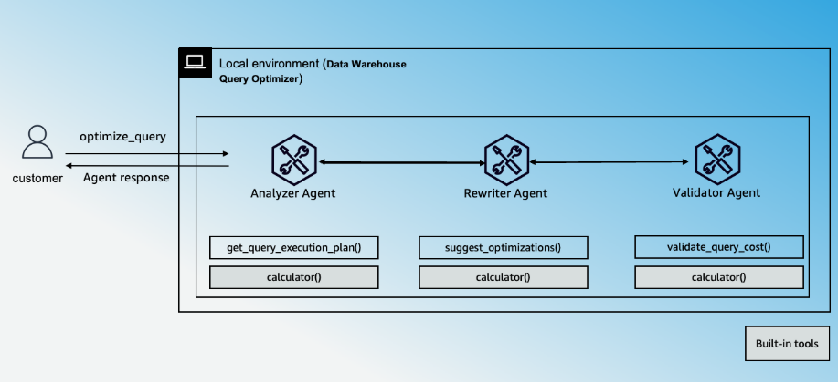

# 🧠 Multi-Agent Data Warehouse Query Optimizer

A multi-agent system to optimize SQL queries on a SQLite database, simulating a data warehouse like Amazon Redshift, using the Strands Agents SDK and Claude 3 Haiku.

---
## Architecture Diagram


  
---
## ✨ Features


| Feature           | Description                                                                  |
|-------------------|------------------------------------------------------------------------------|
| **Agent Structure** | Multi-agent architecture - Sequential                                       |
| **Native Tools**    | `calculator`                                                                |
| **Custom Agents**   | `Analyzer Agent`, `Rewriter Agent`, `Validator Agent`                       |
| **Custom Tools**    | `get_query_execution_plan`, `suggest_optimizations`, `validate_query_cost` |
| **Model Provider**  | Amazon Bedrock                                                              |

---

## ⚙️ Prerequisites

- Python **3.10+**
- [`uv`](https://github.com/astral-sh/uv) for dependency management.
- Enable model access for Anthropic Claude 3.5 Haiku, follow instructions [here](https://docs.aws.amazon.com/bedrock/latest/userguide/model-access-modify.html).
- Ensure you have relevant permissions to invoke Anthropic Claude 3.5 Haiku on Amazon Bedrock. Follow [guidance](https://strandsagents.com/latest/user-guide/quickstart/#configuring-credentials) to configure credentials correctly
- Specify the region using .env file, create the file using [.env.template](./.env.template). Default region is `us-east-1`.

## ⚙️ Setup

Install [uv](https://docs.astral.sh/uv/getting-started/installation/).


**Initialize the SQLite database:**
```bash
uv run scripts/init_db.py
```

## CLI Commands

The following CLI commands allow interaction with the query optimizer:

## 🧪 Sample Usage

You can interact with the multi-agent query optimizer using the following CLI commands:

1. **List Tables**

   Lists all tables in the SQLite database.

   ```bash
   uv run main.py list-tables
   ```
2. **Explain Query**
   Analyzes the execution plan for a given SQL query using the EXPLAIN QUERY PLAN feature.

   ```bash
   uv run main.py explain-query "SELECT * FROM sales_data WHERE order_date > '2025-01-01'"
   ```
3. **Create Bank Table**
   Creates a sample bank table with predefined schema and inserts test data.

   ```bash
   uv run main.py create-bank-table
   ```


## Project Structure

| Component            | File(s)                 | Description                                         |
|----------------------|-------------------------|-----------------------------------------------------|
| CLI Interface        | `main.py`               | Handles CLI commands for listing, explaining queries, and managing tables. |
| Workflow Orchestrator| `main.py`               | Coordinates agents and compiles JSON reports.       |
| Analyzer Agent       | `main.py`, `utils/prompts.py` | Analyzes query execution plans.                     |
| Rewriter Agent       | `main.py`, `utils/prompts.py` | Suggests query optimizations.                       |
| Validator Agent      | `main.py`, `utils/prompts.py` | Validates query cost.                               |
| Database Tools       | `utils/tools.py`         | Manages query plans, optimizations, and cost estimates. |
| Database Initialization | `scripts/init_db.py`   | Initializes the SQLite database with required tables. |
| System Prompts       | `utils/prompts.py`       | Defines system prompts for agents.                  |
| SQLite Database      | `query_optimizer.db`     | Stores database tables.                             |
| AWS Bedrock Integration | `main.py`              | Configures Claude 3 Haiku model.                    |
| OpenTelemetry Logging| `main.py`                | Traces execution and logs reports.                  |


