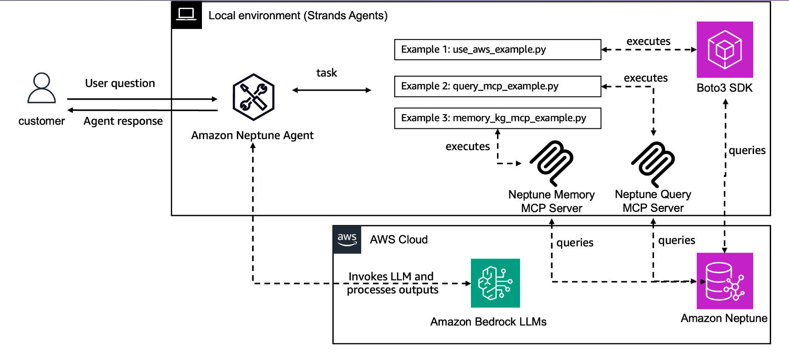

# Using Amazon Neptune with the Strands Agent SDK
Amazon Neptune is a fully managed graph database service by Amazon Web Services (AWS). It's designed to store and query billions of relationships with low latency, making it suitable for applications that rely on highly connected datasets.

This directory contains several examples of how to use Strands Agent SDK with Amazon Neptune.

Within this directory there are several example Python files:

* [memory_kg_mcp_example.py](./memory_kg_mcp_example.py) - This example demonstrates how to use the [Amazon Neptune Memory MCP server](https://github.com/aws-samples/amazon-neptune-generative-ai-samples/tree/main/neptune-mcp-servers/neptune-memory) and [Perplexity MCP server](https://deepwiki.com/ppl-ai/modelcontextprotocol) to research a topic and generate a knowledge graph from the researched information.
* [query_mcp_example.py](./query_mcp_example.py) - This example demonstrates how to use the [Amazon Neptune MCP server](https://github.com/awslabs/mcp/tree/main/src/amazon-neptune-mcp-server) to generate and run queries against a Neptune Database or Neptune Analytics instance.
* [use_aws_example.py](./use_aws_example.py) - This example demonstrates how to use the `use_aws` tool to perform control or data plane actions against a Neptune Database or Neptune Analytics instance. 

|Feature             |Description                                        |
|--------------------|---------------------------------------------------|
|Agent Structure     |Single-agent architecture                           |
|Native Tools        |use_aws|
|MCP Servers         |[Neptune Query](https://github.com/awslabs/mcp/blob/main/src/amazon-neptune-mcp-server/README.md), [Neptune Memory](https://github.com/aws-samples/amazon-neptune-generative-ai-samples/tree/main/neptune-mcp-servers/neptune-memory/README.md). [Perplexity Ask MCP Server](https://github.com/ppl-ai/modelcontextprotocol)               |
|Model Provider      |Amazon Bedrock                                     |

## Getting started

1. Install [uv](https://docs.astral.sh/uv/getting-started/installation/).
2. Configure AWS credentials, follow instructions [here](https://strandsagents.com/latest/user-guide/quickstart/#configuring-credentials).
3. Create a .env file using [.env.template](./.env.template)

## Sample Prompts 
Run the example using `uv run <SELECT EXAMPLE FILE TO RUN> <PROMPT>`.

* `uv run use_aws_example.py "Run this query: MATCH (n) RETURN n LIMIT 10"`

* `uv run query_mcp_example.py "Find me a flight from Seattle to New York that goes through Chicago?"`

* `uv run memory_kg_example.py "I work on the Amazon Neptune team.  I am currently building and testing MCP servers with the Strands Agent SDK to show how you can Amazon Neptune with an agent framework to store memories in the form of a knowledge graph.  I am interested in what key considerations I should take into account?"`

