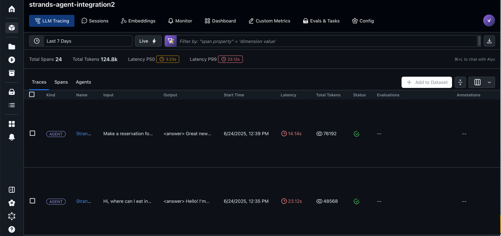
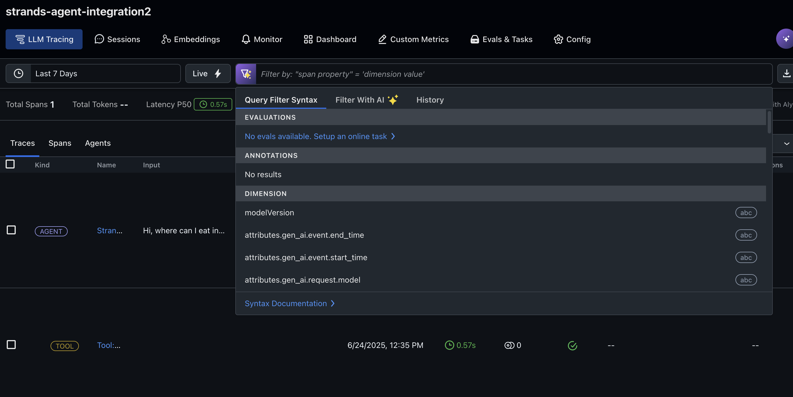
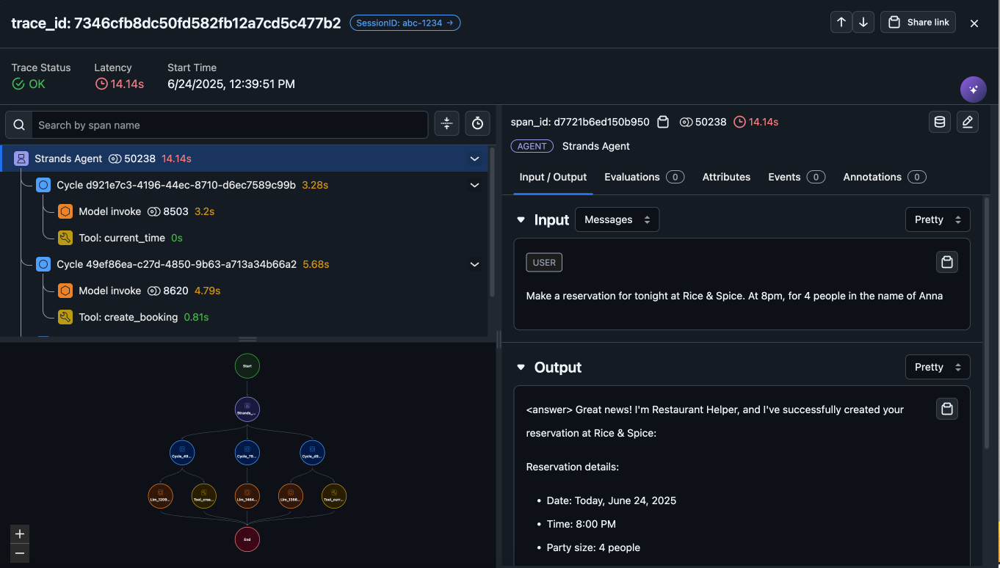
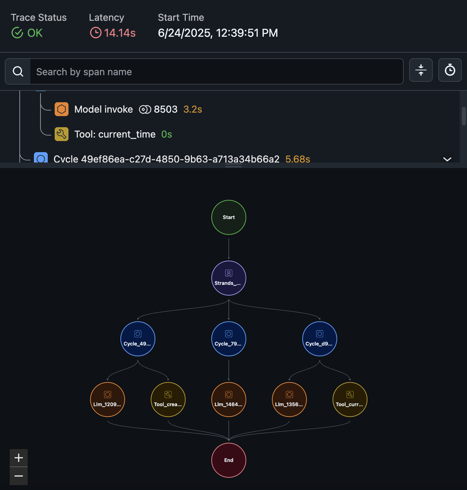
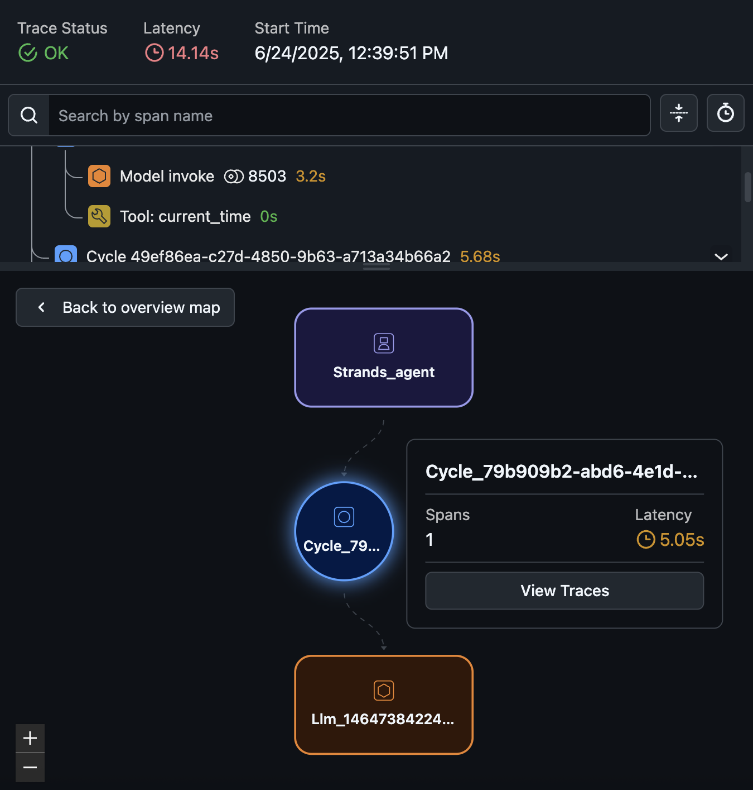
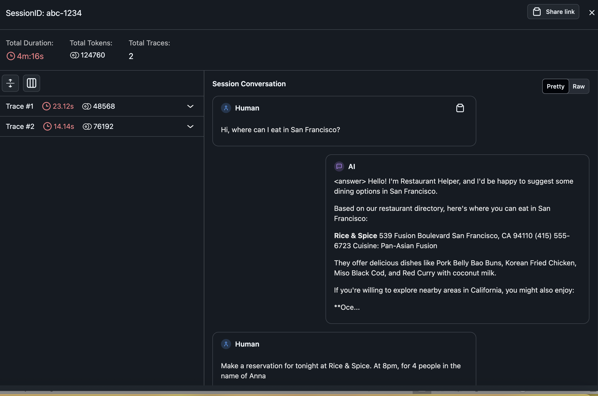
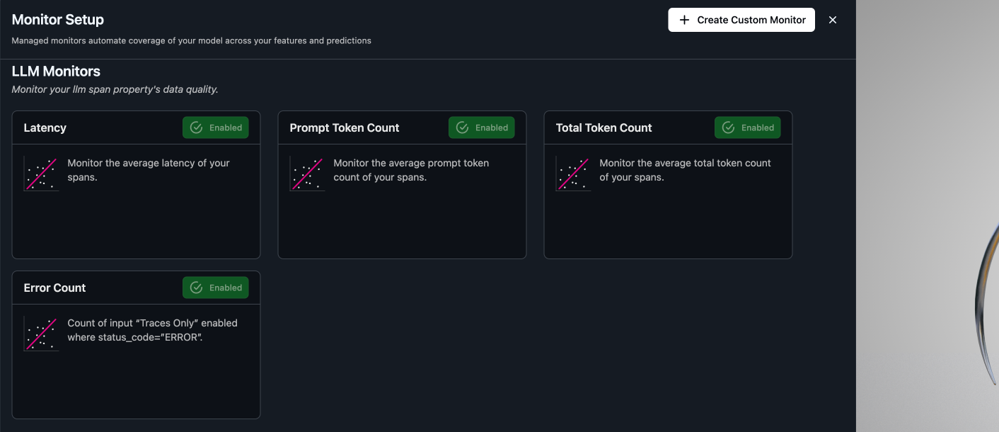
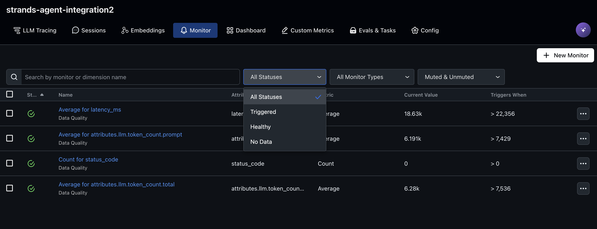

# Strands Agent with OpenInference and Arize Observability

This integration demonstrates how to use Strands Agents with OpenInference and Arize AI for observability. The example builds a restaurant assistant agent that helps customers with restaurant information and reservations.

## Prerequisites

* Python 3.10+
* AWS account with appropriate permissions
* Anthropic Claude 3.7 enabled on Amazon Bedrock
* IAM role with permissions to create Amazon Bedrock Knowledge Base, Amazon S3 bucket and Amazon DynamoDB
* [Arize AI account](https://app.arize.com/signup) with API key and Space ID

## Setup Instructions

1. Clone the repository:
   ```
   git clone https://github.com/strands-agents/samples.git
   cd  03-integrations/Openinference-Arize
   ```

2. Run the notebook:
   ```
   Arize-Observability-openinference-strands.ipynb
   
   ```

3. Update the Arize AI credentials in the notebook:
   - Get your API key and Space ID from [Arize AI dashboard](https://app.arize.com/settings)
   - Replace the placeholder values in the notebook

4. View the traces in the [Arize AI dashboard](https://app.arize.com)

## Trace Visualization and Monitoring in Arize

After running the agent, you can explore the traces and set up monitoring in Arize AI:

### Trace Visualization

1. **Project Traces**  
   

2. **Filtering Traces**  
   

3. **Filtering by Model ID**  
   

4. **Trace Details**  
   

5. **Execution Graph**  
   

6. **Inspecting Execution Paths**  
   

7. **Session Information**  
   

### Monitoring

8. **Pre-built Monitors**  
   

9. **Monitor View**  
   

For more information on monitoring, see the [Arize documentation on  monitoring](https://arize.com/docs/ax/observe/production-monitoring).

## Cleanup Resources

When you're done experimenting, please clean up the AWS resources:

```
sh cleanup.sh
```

## What You'll Learn

- How to set up OpenInference with Arize AI for Strands Agents
- How to use the custom `StrandsToOpenInferenceProcessor` to convert telemetry
- How to build a functional restaurant assistant with Strands
- How to visualize and analyze agent behavior in Arize AI
- How to set up monitoring for your agent in production

## Additional Resources

- [Strands Agents Documentation](https://github.com/strands-agents/sdk-python)
- [OpenInference Specification](https://openinference.ai/)
- [Arize AI Documentation](https://docs.arize.com/)
- [Amazon Bedrock Documentation](https://docs.aws.amazon.com/bedrock/)