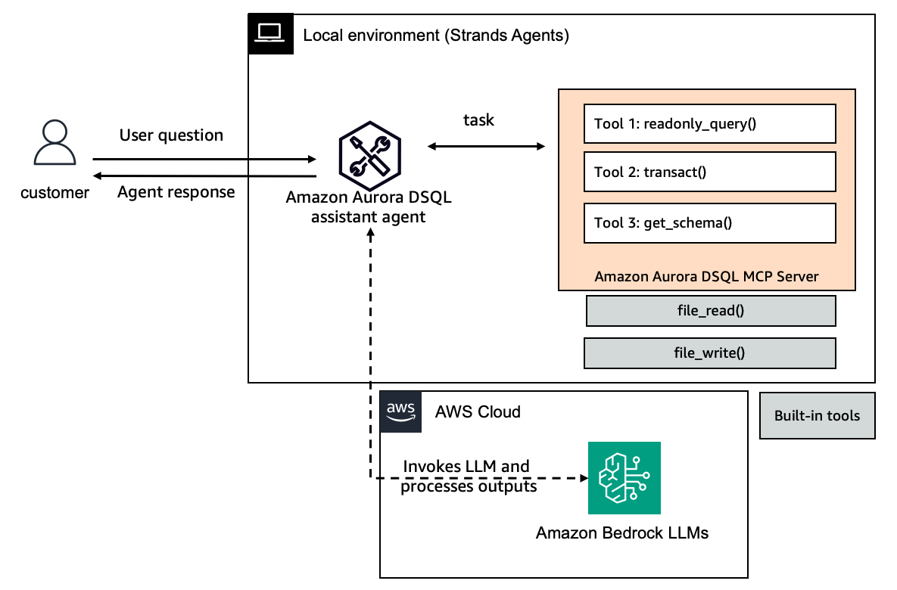

# Strands Agent with Amazon Aurora DSQL

## Overview

Amazon Aurora DSQL is a serverless, distributed relational database service optimized for transactional workloads. Aurora DSQL offers virtually unlimited scale and doesn't require you to manage infrastructure. The active-active highly available architecture provides 99.99% single-Region and 99.999% multi-Region availability.



|Feature             |Description                                        |
|--------------------|---------------------------------------------------|
|Agent Structure     |Single-agent architecture                          |
|Native Tools        |file_read, file_write                              |
|MCP Servers         |[Amazon Aurora DSQL MCP Server](https://pypi.org/project/awslabs.aurora-dsql-mcp-server/)                  |
|Model Provider      |Amazon Bedrock                                     |

## Prerequisites

- An AWS account with an [Aurora DSQL Cluster](https://docs.aws.amazon.com/aurora-dsql/latest/userguide/getting-started.html).
- Set up AWS credentials with access to AWS services
  - You need an AWS account with appropriate permissions
  - Configure AWS credentials with aws configure or environment variables

## Getting Started

1. Install [uv](https://docs.astral.sh/uv/getting-started/installation/).

2. Set up AWS credentials in `.env` using [.env.example](./.env.example).

3. Run the AWS Assistant using `uv run main.py <prompt>`

## Sample Queries

```bash
uv run main.py "List all tables in the database"
uv run main.py "Explain the following query and suggest ways to improve it: ..."
uv run main.py "Create a table called bank with an id column and a balance column using appropriate data types."
uv run main.py "Fill the bank table with 100 rows of random example data. Make sure the sum of all balance columns equals 1000."
```
