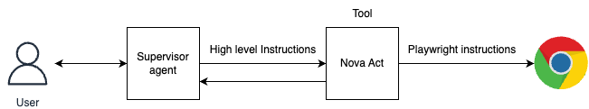

# Nova Act integration with Strands 

Amazon Nova Act is an AI model trained to perform actions within a web browser. Nova Act is currently in research preview and can be accesed via the Nova Act SDK on [Amazon Nova](https://nova.amazon.com/act). Nova Act is an agentic model which can accept natural language instructions and convert them to playwright APIs to execute the instructions on the browser. To learn more about nova act visit [Nova Act](https://labs.amazon.science/blog/nova-act)

## Architecture 

While Nova Act is an agentic model in itself - it can be combined with other agents to build powerful workflows. Nova Act can be useful for integrating with applications where APIs are not avaialble or not easy to integrate. Integrating Nova Act with other agents can also be useful in automating workflows where browser based automation is one of the steps. 

This code sample demonstrates a sample integration of Nova Act with a strands agent. The strands supervisor agent uses Nova Act as a tool to complete the assigned tasks. We show an example of how a financial analyst can generate a report of market losers and gainers using a supervisor agent and Nova Act. 




## Prerequisites

1. Operating System:
    * macOS (Sierra or later)
    * Ubuntu (22.04 LTS or later)
    * Windows:
        * Windows 10 or later
        * Windows Subsystem for Linux 2 (WSL2)
2. Python 3.10 or above.


### 1. Install dependencies

```bash
python -m venv .venv

pip install -r requirements.txt

```
### 2. Nova Act setup

#### Authentication 
Navigate to https://nova.amazon.com/act and generate an API key.

To save it as an environment variable, execute in the terminal:

```bash
export NOVA_ACT_API_KEY="your_api_key"
```

#### [Optional] Install Google Chrome
Nova Act works best with Google Chrome but does not have permission to install this browser. You may skip this step if you already have Google Chrome installed or are fine with using Chromium. Otherwise, you can install Google Chrome by running the following command in the same environment where you installed Nova Act. For more information, visit https://playwright.dev/python/docs/browsers#google-chrome--microsoft-edge.

```bash
playwright install chrome
```
#### Note: If you need to install playwright for installing chrome browser, follow [these](https://playwright.dev/docs/intro) instructions. The first time you run NovaAct, it may take 1 to 2 minutes to start. This is because NovaAct needs to install necessary Playwright modules. Subsequent runs will only take a few seconds to start. 

### 3. Run the supervisor agent 

```bash 
python -u supervisor_agent.py
```
