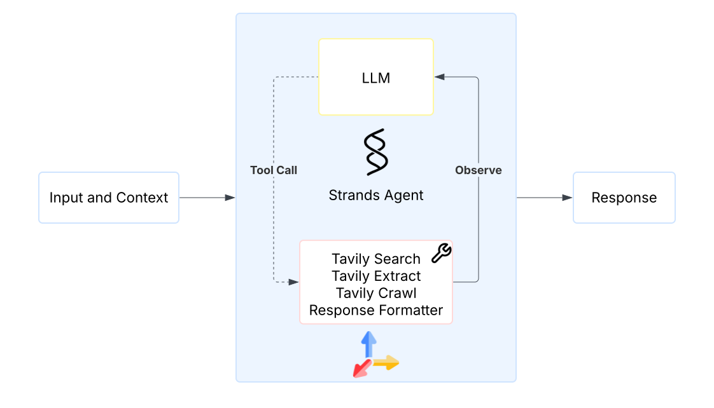
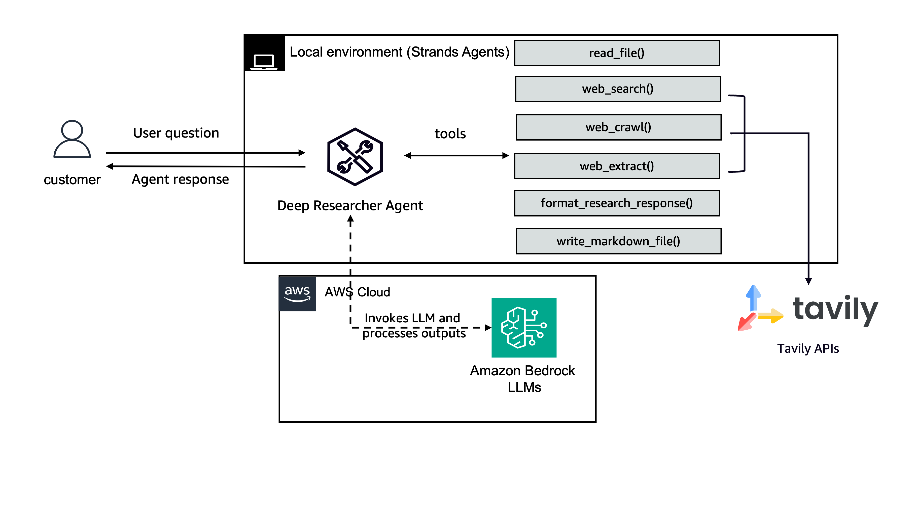

# Supercharge Your Strands Agent with Web Access Using Tavily

## Overview

This tutorial is designed for Python developers who want to empower their Strands agents with real-time web access, enabling agents to utilize up-to-date information as context. Live web information is critical for AI agents tasked with performing research, answering questions accurately, monitoring trends, or providing up-to-date recommendations. You'll learn how to build AI agents that can autonomously search the web, extract valuable content, navigate websites intelligently, and synthesize the relevant information.

|Feature             |Description                                        |
|--------------------|---------------------------------------------------|
| Deep Web Research  | Use [Tavily](https://www.tavily.com/) to perform Web Search, URL Crawling and content extraction |
| Document Enhancement | Augment existing files by incorporating additional information gathered through deep research|
|Mardown Report Generation    | Generate a deep research report in Markdown format   |

## Agenda

Follow the tutorials to build your own web-enabled research agent:

1. **[Deep Research Agent](./deep-research.ipynb)** - Self-contained implementation with Jupyter notebook.
2. **[Interactive CLI Tool](./interactive_cli/README.md)** - Command-line interface, allowing you to perform deep research directly from your terminal.

## Architecture Overview

### Agent Architecture

The agent architecture demonstrating the core components and tool orchestration:

    
     

### Solution Architecture

The complete system architecture showing how the interactive researcher integrates with Tavily API and Amazon Bedrock:

    
     

### 🎥 CLI Demo

Here is a short demo of the CLI interactive Deep researcher:

<video src="https://github.com/user-attachments/assets/d873a93e-5086-4fc8-81c7-38dba12417c8" controls="controls" style="max-width: 730px;">
</video>

---
