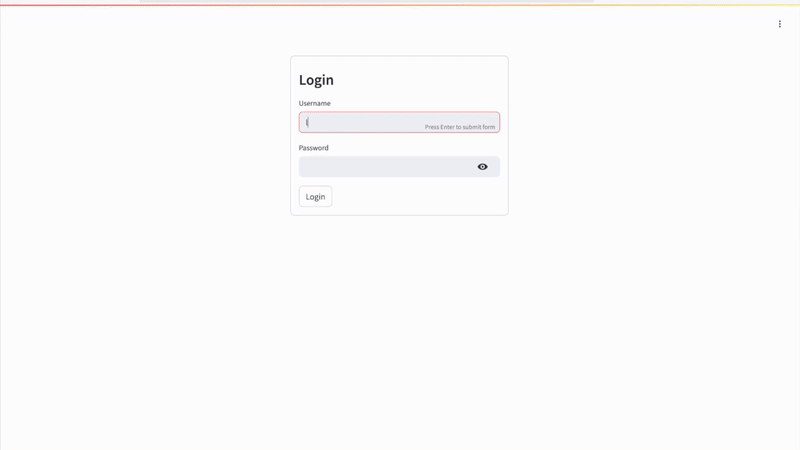
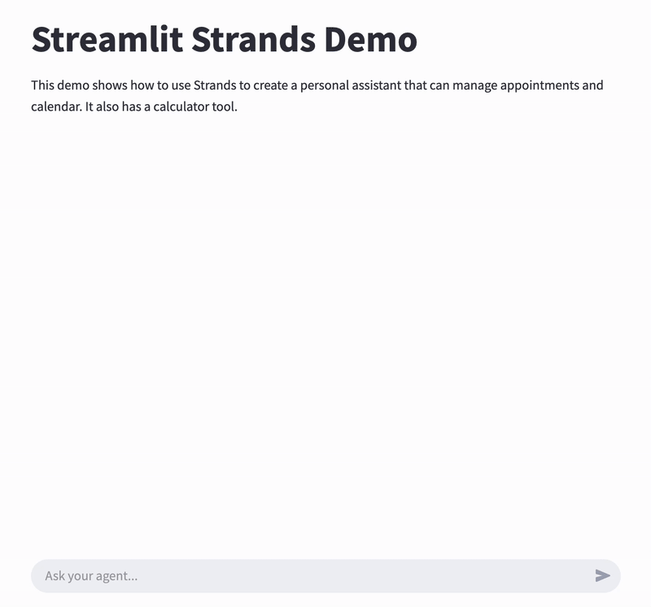

# Streamlit Strands demo

This app demonstrates how to build and deploy a GenAI agent with a web user interface using Streamlit and AWS CDK. While the demo uses a simple appointment management agent (described in the [agent description section](#agent-description)), the main focus is on the deployment architecture and user interface implementation.

It is based on the deploy-streamlit-app sample from this repo:
https://github.com/aws-samples/deploy-streamlit-app

It can be used as a starting point to easily create and deploy a GenAI demo, with web interface and user authentication. It is written in python only, with cdk template to deploy on AWS.

It deploys a basic Streamlit app, and contains the following components:

* The Streamlit app in [Amazon Fargate](https://aws.amazon.com/fargate/) with [ECS](https://aws.amazon.com/ecs/), behind an [Application Load Balancer](https://aws.amazon.com/elasticloadbalancing/application-load-balancer/) and [Amazon CloudFront](https://aws.amazon.com/cloudfront/)
* An [Amazon Cognito](https://aws.amazon.com/cognito/) user pool in which you can manage users

By default, the Streamlit app has the following features:

* Authentication through Cognito (deactivated by default, activate it in `docker_app/config_file.py`)
* A simple Strands agent which manages appointments. You can easily substitute this agent by your own.

A version with streaming is also provided. See [here](#implement-streaming).



## Architecture diagram


## Usage

> **Note:** If you want to test locally without the Authentication feature, you can skip this section and go directly to [Testing and developing locally](#testing-and-developing-locally).

In the docker_app folder, you will find the streamlit app. You can run it locally or with docker.

Note: for the docker version to run, you will need to give appropriate permissions to the container for bedrock access. This is not implemented yet.

In the main folder, you will find a cdk template to deploy the app on ECS / ALB.

Prerequisites:

* python >= 3.8 (tested on 3.11)
* docker
* use a Chrome browser for development
* `anthropic.claude-3-7-sonnet` model activated in Amazon Bedrock in your AWS account. [Instructions](https://docs.aws.amazon.com/bedrock/latest/userguide/model-access-modify.html).
* This demo has been tested on a mac laptop with colima as container runtime, but it should also work with other configurations.
* You also need to install the AWS Command Line Interface (CLI), the AWS Cloud Development KIT (CDK), and to configure the AWS CLI on your development environment. One way to configure the AWS CLI is to get your access key through the AWS console, and use the `aws configure` command in your terminal to setup your credentials.

To deploy:

1. Edit `docker_app/config_file.py`, choose a `STACK_NAME` and a `CUSTOM_HEADER_VALUE`.

> **Important:** If you want to activate authentication, don't forget to set `ENABLE_AUTH = True` in `docker_app/config_file.py`

2. Install dependencies
 
```
python -m venv .venv
source .venv/bin/activate
pip install -r requirements.txt
```

3. Deploy the cdk template

```
cdk bootstrap
cdk deploy
```

The deployment takes 5 to 10 minutes.

Make a note of the output, in which you will find the CloudFront distribution URL
and the Cognito user pool id.

4. Create a user in the Cognito UserPool that has been created. You can perform this action from your AWS Console. For detailed instructions, please refer to [this blog post, section "Create an Amazon Cognito user"](https://aws.amazon.com/blogs/machine-learning/build-and-deploy-a-ui-for-your-generative-ai-applications-with-aws-and-python/).
5. From your browser, connect to the CloudFront distribution url (the one you noted from the CDK output).
6. Log in to the Streamlit app with the user you have created in Cognito.

## Testing and developing locally

After deployment of the cdk template containing the Cognito user pool required for authentication, you can test the Streamlit app directly on your laptop.
You can either use docker, but this would require setting up a role with appropriate permissions, or run the Streamlit app directly in your terminal after having installed the required python dependencies.

To run the Streamlit app directly:

1. If you have activated a virtual env for deploying the cdk template, deactivate it:

```
deactivate
```

2. cd into the streamlit-docker directory, create a new virtual env, and install dependencies:

```
cd docker_app
python -m venv .venv
source .venv/bin/activate
pip install -r requirements.txt
```

3. Launch the streamlit server

```
streamlit run app.py --server.port 8080
```

4. Open `http://localhost:8080/` in your browser, your should see the app.

5. You can now modify the streamlit app to build your own demo!

## Modify this sample to build your own agent

To build your own agent, edit the `docker_app/app.py` file. The key areas you'll want to focus on are:

1. The agent configuration - Look for the `agent = Agent(...)` initialization
2. The UI elements defined using Streamlit components

## Implement streaming

A version with streaming is also provided. Streaming means you'll see the response appear gradually as it's being generated, instead of waiting for the complete response to show up all at once.



To use the streaming version, replace the content of `docker_app/app.py` by the content of `docker_app/app_streaming.py`.

Alternatively, if you run it locally, you can directly run the streaming version. Follow the setup described in the [previous section](#testing-and-developing-locally), then enter:

```
streamlit run app_streaming.py --server.port 8080
```

## Agent description

### Agent Details
    
|Feature             |Description                                                |
|--------------------|-----------------------------------------------------------|
|Native tools used   |current_time, calculator                                   |
|Custom tools created|create_appointment, list_appointments, update_appointments |
|Agent Structure     |Single agent architecture                                  |


### Architecture


### Sample queries

Here are some sample queries you can try with this agent:

* How much is 2+2?
* Book 'Agent fun' for tomorrow 3pm in NYC. This meeting will discuss all the fun things that an agent can do
* Oh no! My bad, 'Agent fun' is actually happening in DC
* What appointments do I have tomorrow?

## Some limitations

* The connection between CloudFront and the ALB is in HTTP, not SSL encrypted.
This means traffic between CloudFront and the ALB is unencrypted.
It is **strongly recommended** to configure HTTPS by bringing your own domain name and SSL/TLS certificate to the ALB.
* The provided code is intended as a demo and starting point, not production ready.
The Python app relies on third party libraries like Streamlit and streamlit-cognito-auth.
As the developer, it is your responsibility to properly vet, maintain, and test all third party dependencies.
The authentication and authorization mechanisms in particular should be thoroughly evaluated.
More generally, you should perform security reviews and testing before incorporating this demo code in a production application or with sensitive data.
* In this demo, Amazon Cognito is in a simple configuration.
Note that Amazon Cognito user pools can be configured to enforce strong password policies,
enable multi-factor authentication,
and set the AdvancedSecurityMode to ENFORCED to enable the system to detect and act upon malicious sign-in attempts.
* AWS provides various services, not implemented in this demo, that can improve the security of this application.
Network security services like network ACLs and AWS WAF can control access to resources.
You could also use AWS Shield for DDoS protection and Amazon GuardDuty for threats detection.
Amazon Inspector performs security assessments.
There are many more AWS services and best practices that can enhance security -
refer to the AWS Shared Responsibility Model and security best practices guidance for additional recommendations.
The developer is responsible for properly implementing and configuring these services to meet their specific security requirements.
* Regular rotation of secrets is recommended, not implemented in this demo.

## Security

See [CONTRIBUTING](../../CONTRIBUTING.md#security-issue-notifications) for more information.
