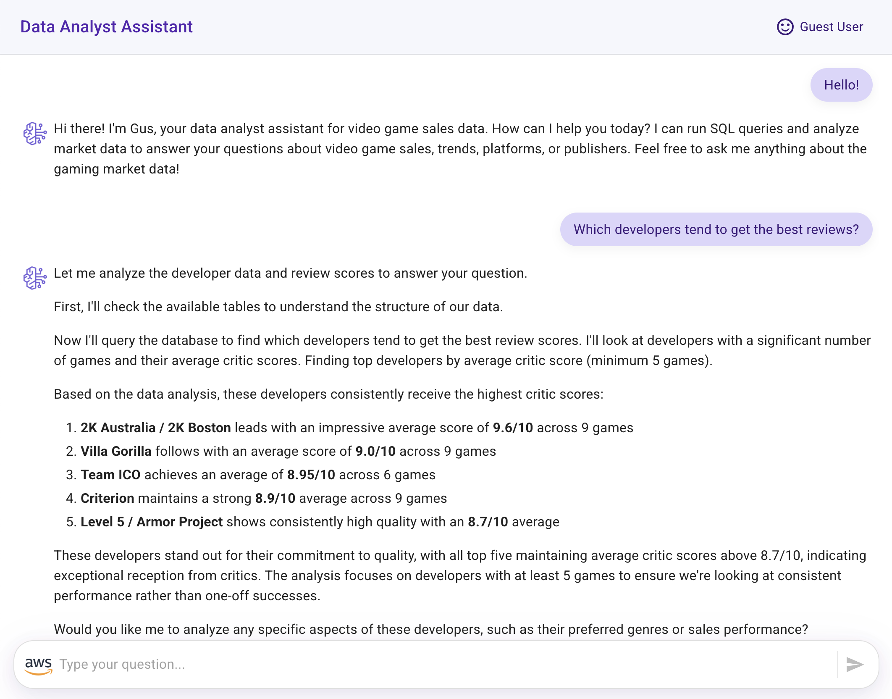
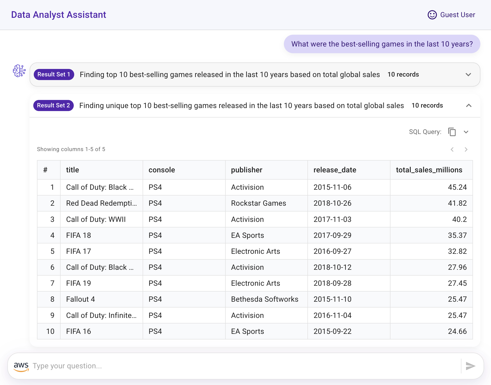
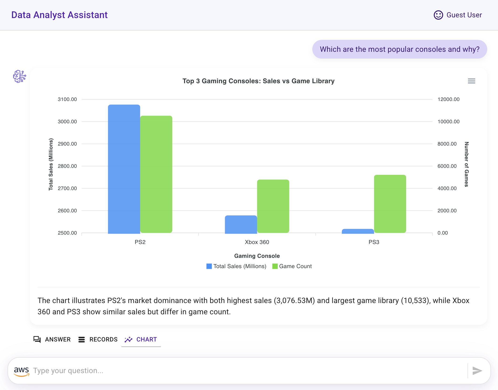
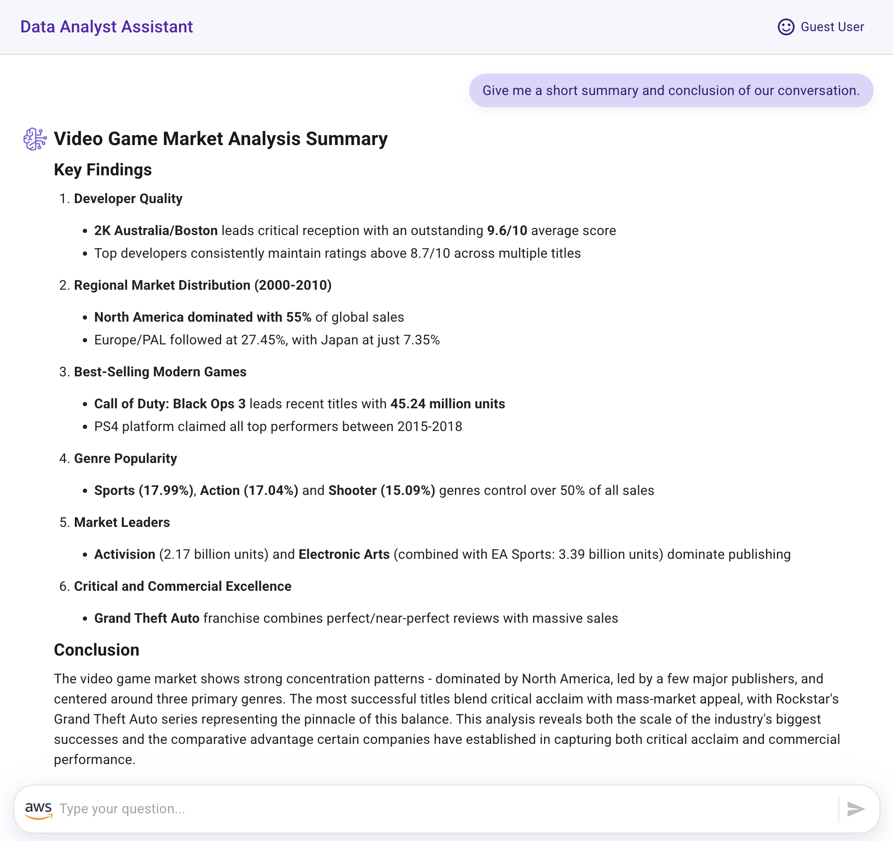

# Front-End Implementation - Integrating Strands Agent with a Ready-to-Use Data Analyst Assistant Application

This tutorial guides you through setting up a React Web application that integrates with your Strands Agent, creating a Data Analyst Assistant for Video Game Sales.

## Overview

By the end of this tutorial, you'll have a fully functional Generative AI web application that allows users to interact with a Data Analyst Assistant interface.

The application consists of:

- **React Web Application**: Delivers the user interface for the assistant
    - The application invokes the Strands Agent endpoint for interacting with the assistant
    - For chart generation, the application directly invokes the Claude 3.5 Sonnet model

> [!IMPORTANT]
> This sample application is for demonstration purposes only and is not production-ready. Please validate the code against your organization's security best practices.

## Prerequisites

Before you begin, ensure you have:

- A deployed Strands Agent from the **Generative AI Application - Data Source and Strands Agent Deployment** tutorial
- [Node.js version 18+](https://nodejs.org/en/download/package-manager)
- React Scripts installed:
``` bash
npm install react-scripts
```

## Set Up the Front-End Application

Navigate to the React application folder (amplify-video-games-sales-assistant-strands-agent/) and install the React application dependencies:

``` bash
npm install
```

## Configure IAM User Access for Front-End Permissions

- [Create an IAM user](https://docs.aws.amazon.com/IAM/latest/UserGuide/id_users_create.html)
- [Create Access key and Secret access key](https://docs.aws.amazon.com/keyspaces/latest/devguide/create.keypair.html) for programmatic access
- Add an inline policy to this user with the following JSON (replace placeholder values with your actual ARNs).

Update the values with your **<agent_endpoint>**, **<account_id>** and **<question_answers_table_arn>** that you can find in the outputs from the SAM tutorial.

``` json
{
    "Version": "2012-10-17",
    "Statement": [
        {
            "Sid": "InvokeBedrockModel",
            "Effect": "Allow",
            "Action": [
                "bedrock:InvokeModel"
            ],
            "Resource": [
                "arn:aws:bedrock:*:<account_id>:inference-profile/us.anthropic.claude-3-5-sonnet-20241022-v2:0",
                "arn:aws:bedrock:us-east-2::foundation-model/anthropic.claude-3-5-sonnet-20241022-v2:0",
                "arn:aws:bedrock:us-east-1::foundation-model/anthropic.claude-3-5-sonnet-20241022-v2:0",
                "arn:aws:bedrock:us-west-2::foundation-model/anthropic.claude-3-5-sonnet-20241022-v2:0"
            ]
        },
        {
            "Sid": "DynamoDB",
            "Effect": "Allow",
            "Action": [
                "dynamodb:Query"
            ],
            "Resource": "<question_answers_table_arn>"
        }
    ]
}
```

## Configure Environment Variables

- Rename the file **src/sample.env.js** to **src/env.js** and update the following environment variables:

    - AWS Credentials and Region:
        - **ACCESS_KEY_ID**
        - **SECRET_ACCESS_KEY**
        - **AWS_REGION**

    - Agent and table information that you can find in the CloudFormation Outputs from the SAM project:
        - **AGENT_ENDPOINT_URL** 
        - **QUESTION_ANSWERS_TABLE_NAME** 

    - Also, you can update the general application description:
        - **APP_NAME**
        - **APP_SUBJECT**
        - **WELCOME_MESSAGE**

## Test Your Data Analyst Assistant

Start the application locally:

``` bash
npm start
```

Try these sample questions to test the assistant:

- Hello!
- How can you help me?
- What is the structure of the data?
- Which developers tend to get the best reviews?
- What were the total sales for each region between 2000 and 2010? Give me the data in percentages.
- What were the best-selling games in the last 10 years?
- What are the best-selling video game genres?
- Give me the top 3 game publishers.
- Give me the top 3 video games with the best reviews and the best sales.
- Which is the year with the highest number of games released?
- Which are the most popular consoles and why?
- Give me a short summary and conclusion of our conversation.

> [!TIP]
> 🚀 For production deployment, consider using **[AWS Amplify Hosting](https://aws.amazon.com/amplify/hosting/)** and integrate Amazon Cognito or another identity provider for proper authentication and authorization instead of using IAM user credentials.

## Application Features

Congratulations! Your Data Analyst Assistant can provide you with the following conversational experience:

- **Conversational interface with an agent responding to user questions**



- **Raw query results displayed in tabular format**



- **Chart visualization generated from the agent's answer and the data query results (created using [Apexcharts](https://apexcharts.com/))**.



- **Summary and conclusion derived from the data analysis conversation**



## Thank You

## License

This project is licensed under the Apache-2.0 License.