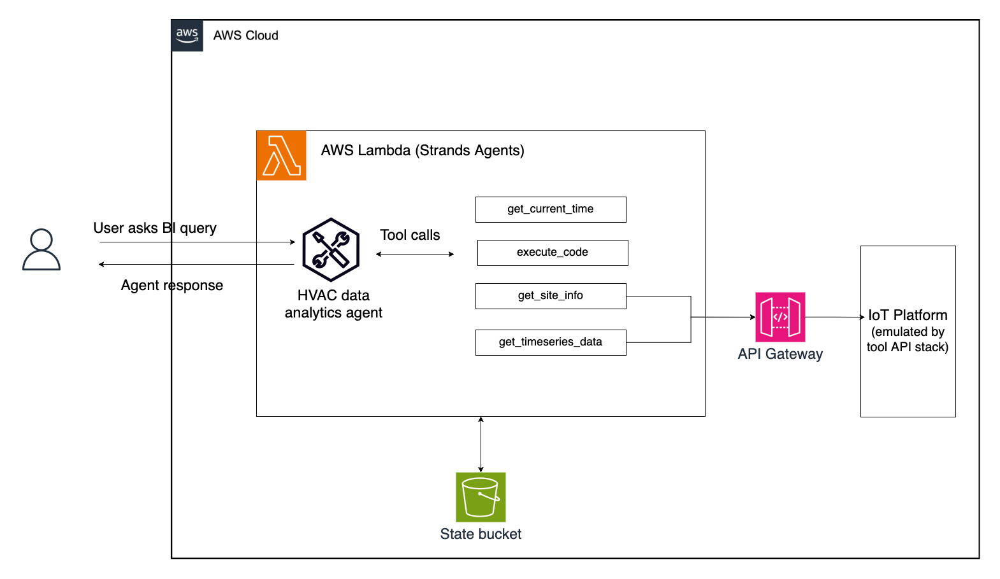
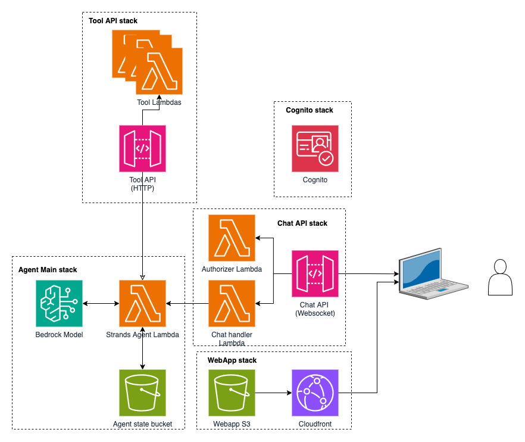
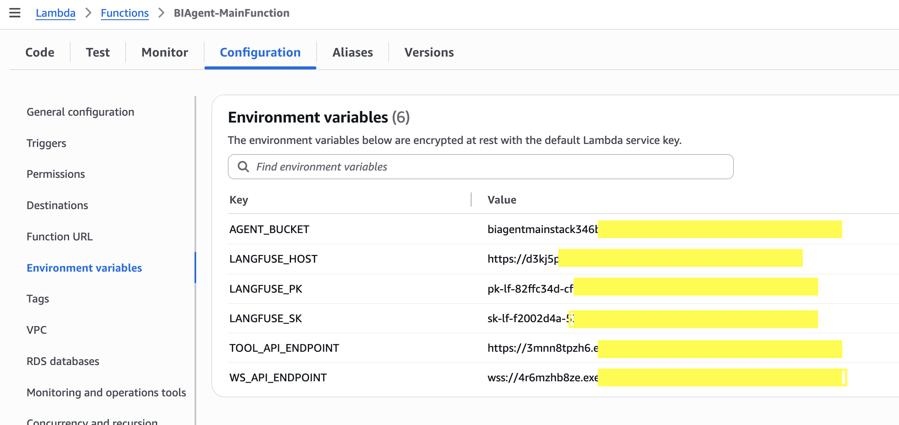

# HVAC Smart Building Analytics Agent

A lightweight conversational AI agent built with Strands SDK that assists facility managers and building operators with HVAC (Heating, Ventilation, and Air Conditioning) data analytics in physical smart buildings. The agent queries relevant data sources and dynamically generates code to process building sensor data before answering user questions.



|Feature             |Description                                        |
|--------------------|---------------------------------------------------|
|Agent Structure     |Single-agent architecture                           |
|Tools        | Get current time, Execute Code, Get Site info (from IoT platform), Get Timeseries data (from IoT pltaform)             |
|Model Provider      |Amazon Bedrock - Anthropic Claude 3.5 Haiku

## Project Overview

This project demonstrates how to implement a smart building analytics assistant using Amazon Bedrock and Strands SDK with minimal code and infrastructure. The agent leverages specialized tools to:

- Query physical building entity hierarchies (buildings, floors, zones, equipment)
- Retrieve time-series data from HVAC sensors and devices in physical buildings
- Generate and execute Python code on-the-fly to process complex data queries
- Provide real-time responses through a WebSocket API

## How It Works: Strands Agent Architecture

This solution showcases the power of Amazon Bedrock and  Strands SDK for building lightweight, efficient AI agents:

1. **Strands Agent Core**: The agent uses a simple, declarative approach to orchestrate complex workflows without requiring extensive code or infrastructure
   
2. **Tool Integration**: The agent seamlessly connects to specialized tools:
   - **Entity Hierarchy Tool**: Queries the building's structural information
   - **Time-Series Data Tool**: Retrieves sensor and device readings over specified time periods
   - **Code Execution Tool**: Dynamically runs the generated Python code to analyze data
   - **Time Tool**: Provides current time information for temporal queries

3. **Reasoning Flow**: The agent follows a lightweight decision-making process:
   - Analyzes user queries to determine required data sources
   - Calls appropriate tools to gather information
   - Generates Python code when complex data processing is needed
   - Executes the code and formats results for human consumption
   - Provides natural language responses with insights from the data

## Architecture Components



The solution consists of several key components:

1. **Agent Main Function**: Core Strands-based agent that processes user queries and generates responses
2. **Tool API**: REST API endpoints for retrieving building data:
   - `/entities` - Gets building entity hierarchies
   - `/timeseries` - Retrieves time-series data from sensors and devices
3. **Web Application**: Frontend interface for interacting with the agent
4. **Authentication**: Cognito-based user authentication

## Prerequisites

- AWS Account with appropriate permissions to create the resources in this architecture and access to Anthropic Claude 3.5 Haiku
- Python 3.12 or higher
- AWS CDK v2 installed : [Installation guide](https://docs.aws.amazon.com/cdk/v2/guide/getting-started.html)
- uv package manager (faster alternative to pip)


## Installation

1. Install uv (if not already installed):
   ```
   pip install uv
   ```

2. Create and activate a virtual environment using uv:
   ```
   uv venv .venv
   source .venv/bin/activate  # On Windows: .venv\Scripts\activate.bat
   ```

3. Install CDK dependencies using uv:
   ```
   uv pip install -r requirements.txt
   ```

4. Deploy the infrastructure:
   ```
   cdk deploy --all
   ```

Note: The required dependencies for the Lambda functions (strands, boto3, requests) are included as pre-packaged zip files in the `layers` directory. These will be automatically used during deployment.

## Project Structure

- `app.py` - Main CDK application entry point
- `smart_building_analytics_agent/` - CDK stack definitions
  - `smart_building_analytics_agent_stack.py` - Main stack definition
  - `agent_main.py` - Agent Lambda function stack
  - `tool_api.py` - Tool API stack for data retrieval
  - `agent_api.py` - API for agent interactions
  - `cognito.py` - Authentication setup
  - `webapp.py` - Web application deployment
- `code/` - Implementation code
  - `lambda/` - Lambda function code
    - `STAgentMain/` - Main agent implementation using Strands
    - `SmartBuildingToolEntitiesApi/` - Entity hierarchy API tool
    - `SmartBuildingToolTimeseriesApi/` - Time-series data API tool
    - `SmartBuildingToolAuthorizer/` - API authorization for the tools
    - `ChatApi/` - API for chat functionality
    - `ApiAuthorizer/` - API authorization
    - `BootstrapCognito/` - Cognito setup
    - `layer-strands/` - Lambda layer for Strands
    - `layer-util/` - Lambda layer for utilities
  - `webapp/` - Web application frontend

## Agent Capabilities in Detail

### 1. Building Information Queries
The agent uses the entity hierarchy tool to retrieve structural information about buildings. When a user asks about zones, floors, or equipment, the agent:
- Calls the `get_site_info(site_id)` tool to retrieve the complete entity hierarchy
- Parses the returned JSON structure to find relevant information
- Formats the response in a user-friendly way

### 2. Time-Series Data Analysis
For queries about sensor readings or device performance:
- The agent determines the required entity_id, property, and time range
- Calls the `get_timeseries_data(entity_id, property, start_time, end_time)` tool
- Receives raw time-series data in a structured format

### 3. Dynamic Code Generation and Execution
What makes this agent powerful is its ability to write and execute code on-the-fly:
- For complex analytical queries, the agent generates Python code to process the data
- The code typically uses pandas for data manipulation and matplotlib for visualization
- The `execute_code(code)` tool runs this code in a secure environment
- Results are formatted and returned to the user with explanations

## Lets try our new agent!

After deployment, you can interact with the agent through the web interface. You can find the link to the web ui in the outputs of the WebAppstack that is deployed with this CDK. 

- Navigate to the WebAppStack in Cloudformation in AWS console and look for the 'CloudFrontURL' in the Outputs tab. Open this link in a new tab.
- Navigate to the CognitoStack in the Cloudformation in AWS console and look for the 'Username' and 'Password' in the Outputs tab. Use these credentials to login to the web ui.
- In AWS console, navigate to the Amazon Bedrock page and verify that you have access to Anthropic Claude 3.5 Haiku model.

Example queries:
- "How many zones are on the first floor?"
- "What was the max temperature in Zone 5 in first floor yesterday?"
- "How does this compre with the day before yesterday?"


## Observability with Langfuse

This agent includes built-in support for Langfuse tracing, which provides detailed observability into agent operations, tool usage, and performance metrics.

### What is Langfuse?

Langfuse is an open-source observability platform specifically designed for LLM applications. It helps track:
- Agent execution flows
- Tool invocations and responses
- Token usage and costs
- Latency metrics
- Prompt engineering effectiveness

### Setting Up Langfuse

The agent is pre-configured with environment variables for Langfuse integration:



To enable tracing:

1. Deploy a serverless Langfuse instance on AWS using the guide at [aws-samples/deploy-langfuse-on-ecs-with-fargate](https://github.com/aws-samples/deploy-langfuse-on-ecs-with-fargate)
2. Obtain your Langfuse public and secret keys from your deployed instance
3. Update the environment variables in the agent's Lambda function with your actual keys and host URL

The serverless deployment uses:
- Amazon ECS with Fargate for containerized deployment
- Amazon RDS PostgreSQL for data storage
- Application Load Balancer for traffic management
- AWS Secrets Manager for secure credential storage

Once configured, you'll be able to view detailed traces of all agent interactions in your Langfuse dashboard, helping you optimize performance and troubleshoot issues.


## Cleaning Up Resources

When you're done experimenting with this agent, you can easily remove all deployed AWS resources to avoid incurring additional costs. Run the command below:

```bash
cdk destroy --all
```

This command will remove all AWS resources that were created by the CDK stack for this sample.
