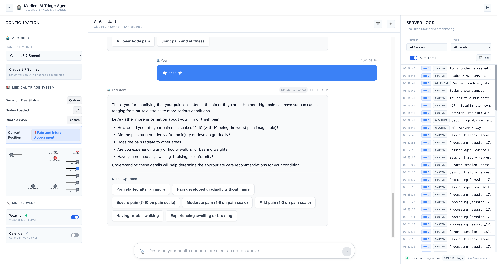
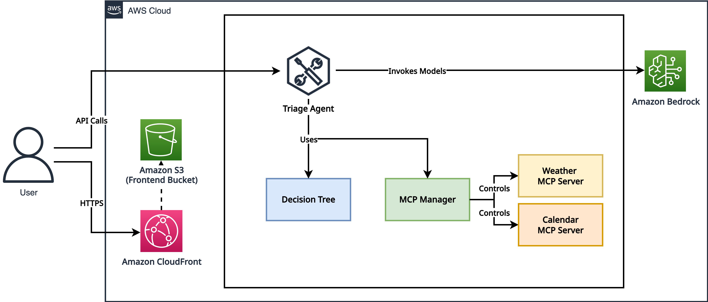

# AI Triage Agent

> **A demonstration of AI-powered medical triage using structured decision tree navigation**

This is **AI Triage Agent**, a demonstration of an AI-powered medical triage system that showcases intelligent patient assessment through **"structured decision tree navigation"**. The project leverages Amazon Bedrock through the Strands AI framework and MCP (Model Context Protocol) servers, with integrated calendar scheduling and weather information for comprehensive patient care coordination.



_AI-powered medical triage system with structured decision tree navigation and intelligent patient assessment_

## Important Disclaimer

**⚠️ This is a Proof of Concept (PoC) demonstration only.** This application is designed for educational and demonstration purposes to showcase AI integration capabilities and productivity tool orchestration. It is not intended to provide medical advice, professional consultation, or replace qualified professional judgment in any domain.

The AI responses and any data generated are produced by artificial intelligence models and should be treated as mock/demo content only. Use this application at your own risk. The developers and contributors are not responsible for any decisions made based on the output from this system.

For any medical, legal, financial, or other professional advice, please consult with qualified professionals in the respective fields.

## Architecture Overview



| Feature | Description |
|---------|-------------|
| **Agent Structure** | Single-agent architecture with structured decision tree navigation |
| **MCP Tools** | Weather information, calendar scheduling, and external system integration with `mcp.json` |
| **Model Provider** | Amazon Bedrock with Claude or Nova for intelligent medical triage |
| **Deployment** | AWS CloudFormation with EC2, S3, CloudFront, and VPC infrastructure |

## Features

This project demonstrates how AI can assist in medical triage workflows by providing structured patient assessment, intelligent questioning, and decision tree navigation. The system showcases how healthcare organizations could potentially streamline initial patient evaluations while maintaining safety and accuracy standards.

**AI Triage Agent** demonstrates essential medical triage functions through an intelligent interface that:

- **AI-Powered Medical Assessment**: Demonstrates structured patient evaluation workflows and intelligent questioning
- **Decision Tree Navigation**: Showcases systematic medical triage decision-making processes
- **Calendar Integration**: Demonstrates appointment scheduling and healthcare provider coordination
- **Weather Intelligence**: Shows how environmental factors can be integrated into patient care decisions
- **Intelligent Healthcare Conversations**: Demonstrates AI assistants that understand medical context and workflows

## Quick Start

To get started with the AI Triage Agent, follow these simple steps:

### Prerequisites

- Python 3.11 or higher
- Node.js 16 or higher
- npm or yarn package manager

### Installation

#### 1. Clone Repository

```bash
git clone https://github.com/strands-agents/samples.git
cd samples/04-UX-demos/04-triage-agent
```

#### 2. Configure AWS Credentials

**Option A: AWS CLI**

```bash
aws configure
```

**Option B: Environment Variables**

```bash
export AWS_ACCESS_KEY_ID=<your_access_key>
export AWS_SECRET_ACCESS_KEY=<your_secret_key>
export AWS_DEFAULT_REGION=<aws_region>
```

#### 3. Launch Application

```bash
bash start.sh
```

The startup script automatically:

- Creates Python virtual environment
- Installs all dependencies (Python & Node.js)
- Starts backend server (port 8000)
- Starts frontend server (port 3000)
- Checks port availability

#### 4. Access Application

| Service     | URL                   | Description                |
| ----------- | --------------------- | -------------------------- |
| Frontend    | http://localhost:3000 | Main application interface |
| Backend API | http://localhost:8000 | REST API endpoints         |

#### 5. Stop Application

```bash
bash stop.sh
```

The application will automatically check for port availability and guide you through any issues.

## AWS Deployment

### Infrastructure as Code

Deploy to AWS using the provided CloudFormation template:

```bash
cd deploy
./deploy.sh
```

### AWS Resources

| Service        | Purpose          | Configuration                  |
| -------------- | ---------------- | ------------------------------ |
| **EC2**        | Backend hosting  | FastAPI application server     |
| **S3**         | Frontend hosting | Static website bucket          |
| **CloudFront** | CDN              | Global content distribution    |
| **VPC**        | Networking       | Secure network infrastructure  |
| **Bedrock**    | AI Services      | Claude 3.7 Sonnet model access |

## Development Workflow

### Project Methodology

This project follows an iterative development approach:

1. **Requirements Analysis** - Define functional and technical requirements
2. **Architecture Design** - Plan system components and AWS infrastructure
3. **Implementation** - Develop source code and infrastructure as code
4. **Testing** - Deploy to test environment and run integration tests
5. **Documentation** - Update README and planning documents

### Version Control

- Ensure Git repository is properly configured
- Commit changes to README.md and planning files as development progresses
- Follow conventional commit message format

### Development Standards

- **Code Quality** - Follow PEP 8 for Python, ESLint for JavaScript
- **Testing** - Unit tests for backend, integration tests for full stack
- **Documentation** - Keep README current with project evolution
- **Security** - Follow AWS security best practices

## Project Structure

### Directory Layout

```
04-triage-agent/
├── backend/                           # Python FastAPI Backend
│   ├── main.py                       # FastAPI application entry point
│   ├── mcpmanager.py                 # MCP server orchestration
│   ├── mcp.json                      # MCP server configuration
│   ├── requirements.txt              # Python dependencies
│   └── mcp_servers/                  # MCP Protocol Implementations
│       ├── task_manager_server.py    # Task management services
│       ├── calculator_server.py      # Mathematical operations
│       ├── calendar/                 # Appointment scheduling
│       ├── weather/                  # Environmental data services
│       ├── email_history/            # Communication management
│       └── strands/                  # AI agent integration
├── frontend/                          # React Frontend Application
│   ├── public/                       # Static assets and resources
│   ├── src/                          # React source code
│   │   ├── App.js                   # Main application component
│   │   └── components/              # Reusable UI components
│   ├── package.json                 # Node.js dependencies
│   └── tailwind.config.js           # Tailwind CSS configuration
├── start.sh                          # Development server startup
├── stop.sh                           # Development server shutdown
├── preview.png                       # Application screenshot
└── README.md                         # Project documentation
```

### Technology Stack

#### Backend Technologies

| Technology   | Version | Purpose                        |
| ------------ | ------- | ------------------------------ |
| Python       | 3.11+   | Core backend language          |
| FastAPI      | Latest  | High-performance web framework |
| AWS Bedrock  | -       | AI model hosting and inference |
| Strands AI   | Latest  | Agent development framework    |
| MCP Protocol | Latest  | Tool communication standard    |

#### Frontend Technologies

| Technology   | Version | Purpose                     |
| ------------ | ------- | --------------------------- |
| React        | 18+     | User interface framework    |
| Tailwind CSS | Latest  | Utility-first CSS framework |
| Axios        | Latest  | HTTP client library         |

#### Infrastructure & DevOps

| Service        | Purpose                              |
| -------------- | ------------------------------------ |
| AWS Bedrock    | AI model hosting (Claude 3.7 Sonnet) |
| AWS EC2        | Application hosting                  |
| AWS S3         | Static asset storage                 |
| AWS CloudFront | Content delivery network             |
| CloudFormation | Infrastructure as Code               |

## System Architecture

### High-Level Design

The application implements a modern, scalable architecture:

```
┌─────────────────┐    ┌─────────────────┐    ┌─────────────────┐
│   React SPA     │───▶│FastAPI + Strands│───▶│   AWS Bedrock   │
│   (Frontend)    │    │   (Backend)     │    │     (LLMs)      │
└─────────────────┘    └─────────────────┘    └─────────────────┘
                                 │
                                 ▼
                        ┌─────────────────┐
                        │  MCP Servers    │
                        │  (Tools/APIs)   │
                        └─────────────────┘
                                 │
                                 │
                                 ▼
                    ┌─────────────────────────┐
                    │   External Services     │
                    │ (Calendar, Weather, etc)│
                    └─────────────────────────┘
```

### Key Components

- **React Frontend** - Responsive SPA with Tailwind CSS styling
- **FastAPI Backend** - Async Python server with high performance
- **MCP Integration** - Standardized protocol for tool communication
- **AWS Bedrock** - Claude 3.7 Sonnet for advanced AI capabilities
- **Session Management** - Stateful conversation flow handling

## Contributing

Please refer to [CONTRIBUTING.md](../../CONTRIBUTING.md) for detailed contribution guidelines, development practices, and code standards.

## License

This project is licensed under the **MIT License** - see [LICENSE.md](../../LICENSE.md) for details.

<div align="center">
  <p><strong>Built with ❤️ using Strands Agents</strong></p>
</div>
