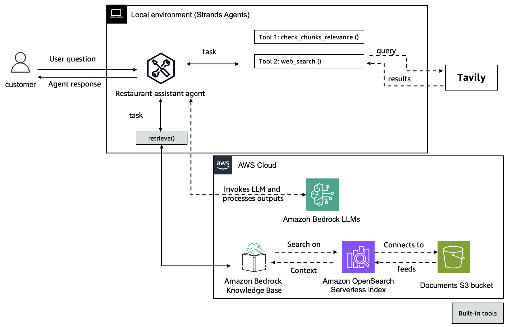

# 🛠️ Corrective RAG Agent

## Overview

This project demonstrates a **Corrective Retrieval-Augmented Generation (RAG)** system built using **Strand Agents**. The system is designed to identify low relevance responses to users questions responses and automatically refine queries or responses using multiple tools.

| Feature             | Description                                                 |
| ------------------- | ----------------------------------------------------------- |
| Agent Structure     | Modular multi-tool agent using Strands SDK          |
| Native Tools        | `retrieve` |
| Custom Tools | check_chunks_relevance, web_search        |
| External APIs       |  Tavily Web Search                |

---

## Key Features

### 1. Retrieval and Correction Agent 🔍

* Uses **Amazon Bedrock Knowledge Bases** for retrieval and response generation
* Integrates a **feedback-based correction loop** using RAGAS metrics
* Dynamically re-queries based on detected context precision errors

### 2. Evaluation Module 🧪

* Applies **LLM-based precision scoring**
* Automatically reroutes failed responses for augmentation
* Built with `ragas`, `Langchain`, and `Strand Agent` tooling

### 3. External Web Search 🌐

* Integrates **Tavily** API for real-time, factual augmentation
* Invoked when knowledge base retrieval chunks relevance is low

---

## Getting Started

### 1. Prerequisites

Before running the corrective rag notebook, ensure the following prerequisites are completed:

- Run the `prerequisites` notebook in this folder
- Python 3.10 or later
- An AWS account
- You have a Tavily API key
- Anthropic Claude 3.7 enabled in Amazon Bedrock
- IAM role with permissions for:
  - Amazon Bedrock Knowledge Base
  - Amazon S3
  - Amazon OpenSearch Serverless

### 2. Run the Notebook

Run the **1-corrective-rag-agent.ipynb** notebook.

