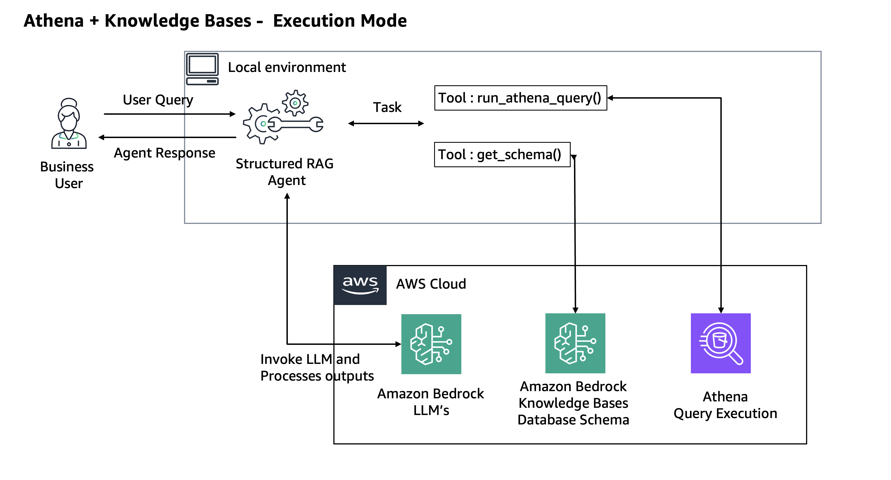

# Adaptive Structured RAG Agent

An Adaptive Structured RAG agent that converts natural language questions into SQL queries with self-correcting feedback loops. This agent features dual-mode support for both local SQLite databases and AWS Athena, and intelligent error handling. The agent includes knowledge base integration for schema information and can handle complex SQL queries.

## Features

- Convert natural language questions to SQL queries
- Self-correcting feedback loop for error handling
- Dual mode support: Local SQLite or AWS Athena
- Knowledge base integration for schema information
- Wealth management domain-specific schema

## Prerequisites

- **AWS Environment Access**: This agent requires access to an AWS environment if you use Amazon Bedrock as model provider
  - AWS credentials configured (via AWS CLI, environment variables, or IAM roles)
  - **Model Access**: Enable access to Claude 3.7 Sonnet model in Amazon Bedrock console
    - Navigate to Amazon Bedrock → Model access
    - Request access to "Anthropic Claude 3.7 Sonnet" model
    - Wait for approval (usually immediate for supported regions)
  - **Athena mode Access**: 
    - Additional access to Amazon Athena and S3
    - Create Amazon Bedrock for knowledge base with sample wealthmanagement schema
- Python 3.11 or higher
- Virtual environment (recommended)

## Architecture

The NL2SQL agent implements a structured RAG (Retrieval-Augmented Generation) approach with dual execution modes. The agent processes natural language queries, retrieves relevant schema information, generates SQL queries, and executes them with self-correction capabilities.

### Architecture Overview

The agent supports two execution modes & architecture, each optimized for different use cases:

#### SQLite Mode (Default)
**Use Case**: Local development, testing, and demonstrations


*SQLite Execution Mode - Local development and testing*

**Components**:
- **Database**: SQLite (`wealthmanagement.db`) - Local file-based database
- **Schema Source**: Hardcoded wealth management schema in knowledge base tool
- **Query Engine**: Direct SQLite execution with local file access
- **LLM Provider**: Amazon Bedrock (Claude 3.7 Sonnet)

**Architecture Flow**:
1. User submits natural language query
2. Structured RAG Agent processes the request
3. `get_schema()` tool retrieves hardcoded database schema
4. Agent generates SQL query using LLM
5. `run_sqlite_query()` tool executes query against local SQLite database
6. Results are processed and returned to user

#### AWS Athena Mode
**Use Case**: Production environments with large-scale data processing


*Athena + Knowledge Bases Execution Mode - Production AWS environment*

**Components**:
- **Database**: Your choice of Amazon Datastores like AWS Glue that can be queried through Athena
- **Schema Source**: AWS Bedrock Knowledge Base with dynamic schema retrieval
- **Query Engine**: Athena with S3 output location for results
- **LLM Provider**: Amazon Bedrock (Claude 3.7 Sonnet)

**Architecture Flow**:
1. User submits natural language query
2. Structured RAG Agent processes the request
3. `get_schema()` tool queries AWS Bedrock Knowledge Base for current schema
4. Agent generates SQL query using LLM
5. `run_athena_query()` tool executes query via Amazon Athena
6. Query results stored in S3 and returned to user

## Model Configuration

### Default Model
The Strands Agent framework uses **Claude 3.7 Sonnet** as the default model for natural language processing and SQL generation. 

### Custom Model Providers
You can configure the agent to use different model providers by modifying the agent initialization in `src/agent.py`. The Strands framework supports multiple model providers. 

For detailed information on configuring different model providers, refer to the [Strands Model Providers documentation](https://strandsagents.com/latest/user-guide/concepts/model-providers/amazon-bedrock/).

## Setup

### 1. Create and activate a virtual environment:

```bash
python3 -m venv .venv
source .venv/bin/activate
```

### 2. Install dependencies:

```bash
python -m pip install strands-agents strands-agents-tools boto3
```

### 3. Set up local SQLite database:

**This setup is optional, if you use wealthmanagement.db in this repo.** 

```bash
# Create data directory
mkdir -p data
cd data

# Initialize SQLite database
sqlite3 wealthmanagement.db
```

Execute the following SQL commands in the SQLite shell:

```sql
-- Create client table
CREATE TABLE client (
    client_id INTEGER PRIMARY KEY NOT NULL,
    first_name TEXT,
    last_name TEXT,
    age INTEGER,
    risk_tolerance TEXT
);

-- Create investment table
CREATE TABLE investment (
    investment_id INTEGER PRIMARY KEY NOT NULL,
    client_id INTEGER,
    asset_type TEXT,
    investment_amount REAL,
    current_value REAL,
    purchase_date VARCHAR,
    FOREIGN KEY (client_id) REFERENCES client(client_id)
);

-- Create portfolio_performance table
CREATE TABLE portfolio_performance (
    client_id INTEGER NOT NULL,
    year INTEGER NOT NULL,
    total_return_percentage REAL,
    benchmark_return REAL,
    PRIMARY KEY (client_id, year),
    FOREIGN KEY (client_id) REFERENCES client(client_id)
);

-- Insert sample clients
INSERT INTO client (client_id, first_name, last_name, age, risk_tolerance) VALUES
(1, 'John', 'Smith', 45, 'Conservative'),
(2, 'Sarah', 'Johnson', 38, 'Moderate'),
(3, 'Michael', 'Brown', 52, 'Aggressive'),
(4, 'Emily', 'Davis', 29, 'Moderate'),
(5, 'Robert', 'Wilson', 61, 'Conservative');

-- Insert sample investments
INSERT INTO investment (investment_id, client_id, asset_type, investment_amount, current_value, purchase_date) VALUES
(1, 1, 'Bonds', 50000.00, 52000.00, '2023-01-15'),
(2, 1, 'Stocks', 30000.00, 35000.00, '2023-03-10'),
(3, 2, 'Stocks', 75000.00, 82000.00, '2022-06-20'),
(4, 2, 'ETF', 25000.00, 27500.00, '2023-02-05'),
(5, 3, 'Stocks', 100000.00, 125000.00, '2022-01-10'),
(6, 3, 'Options', 20000.00, 18000.00, '2023-05-15'),
(7, 4, 'Mutual Funds', 40000.00, 43000.00, '2023-01-20'),
(8, 5, 'Bonds', 80000.00, 81000.00, '2022-12-01');

-- Insert sample portfolio performance
INSERT INTO portfolio_performance (client_id, year, total_return_percentage, benchmark_return) VALUES
(1, 2022, 8.5, 7.2),
(1, 2023, 12.3, 10.1),
(2, 2022, 15.2, 12.8),
(2, 2023, 18.7, 15.3),
(3, 2022, 22.1, 18.5),
(3, 2023, 25.8, 20.2),
(4, 2022, 11.4, 9.8),
(4, 2023, 14.6, 12.1),
(5, 2022, 6.8, 5.9),
(5, 2023, 7.2, 6.5);
```

Exit SQLite shell:
```sql
.quit
```

## Usage

### Command Line Examples

#### Local SQLite Mode (Default):
```bash
# Basic query
python main.py --question "How many clients do we have?"

# Specify SQLite engine explicitly
python main.py --engine sqllite --question "Show me all conservative clients"

# Complex query
python main.py -q "What's the total investment amount for each risk tolerance level?"
```

#### AWS Athena Mode:
```bash
# Use Athena engine
python main.py --engine athena --question "How many clients do we have?"

# Complex Athena query
python main.py -e athena -q "Show portfolio performance above benchmark for 2023"
```

## Project Structure

```
nl2sql_agent/
├── .venv/                          # Virtual environment
├── data/
│   └── wealthmanagement.db         # SQLite database
├── src/                            # Source code
│   ├── __init__.py
│   ├── agent.py                    # Main agent implementation
│   └── tools/                      # Strands tools implementation
│       ├── __init__.py
│       ├── knowledge_base_tool.py  # Schema retrieval (hardcoded + AWS)
│       ├── athena_tool.py          # AWS Athena query execution
│       └── sqllite_tool.py         # SQLite query execution
├── config.py                       # Configuration management
├── main.py                         # Entry point
└── README.md
```

## Configuration Details

The agent uses `config.py` for environment-specific settings:

- **AWS Region**: Default `us-east-1`
- **Athena Database**: Athena / Glue database name
- **Athena Output**: Athena S3 output location for query results
- **Knowledge Base ID**: AWS Bedrock Knowledge Base identifier

## Development Status

- ✅ Local SQLite implementation with wealth management schema
- ✅ AWS Athena integration
- ✅ Knowledge base tool with hardcoded schema fallback
- ✅ Self-correcting feedback loop
- ✅ Dual engine support (SQLite/Athena)

## Troubleshooting

### Common Issues

1. **Database not found**: Ensure `wealthmanagement.db` exists in `./data/` directory
2. **AWS credentials**: Set up AWS credentials for Model Access and Athena mode
3. **Missing dependencies**: Install required packages with pip
4. **Query syntax errors**: Check SQL syntax compatibility between SQLite and Athena

### Logging

The agent provides detailed logging. Check console output for:
- Query execution status
- Error messages and corrections
- Schema retrieval information
